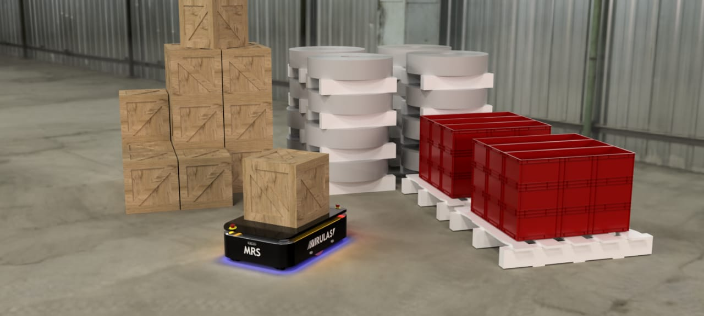
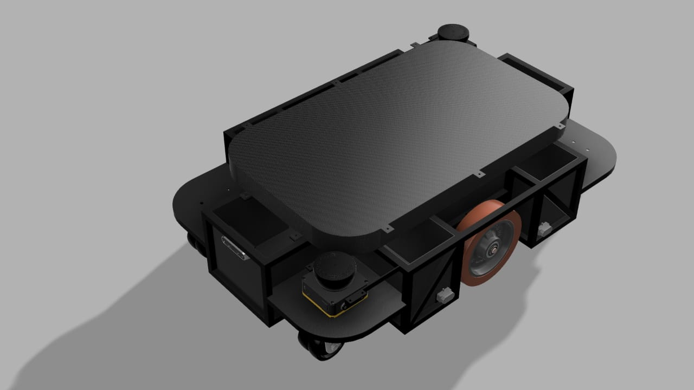
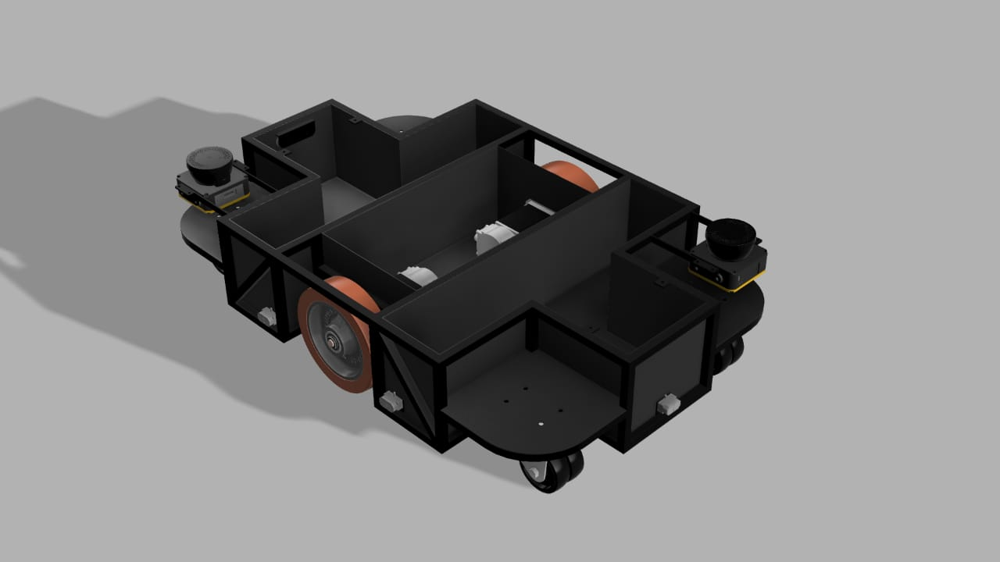
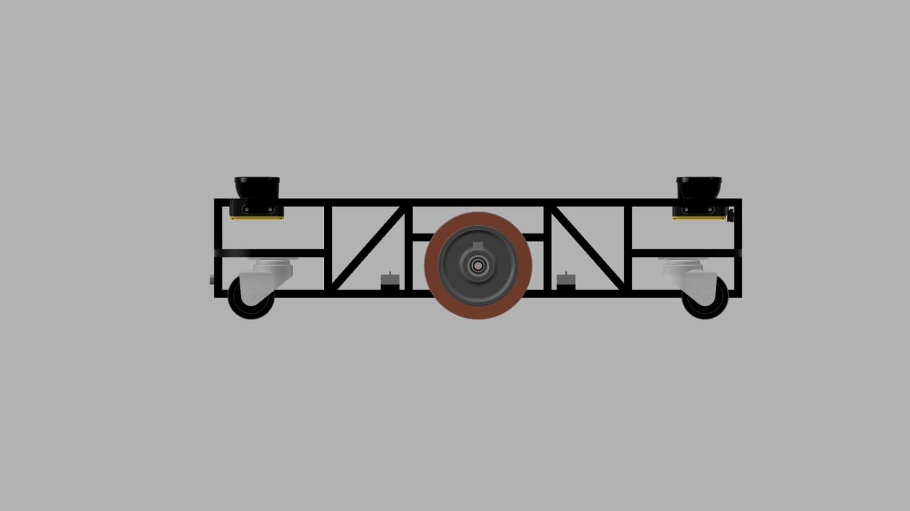
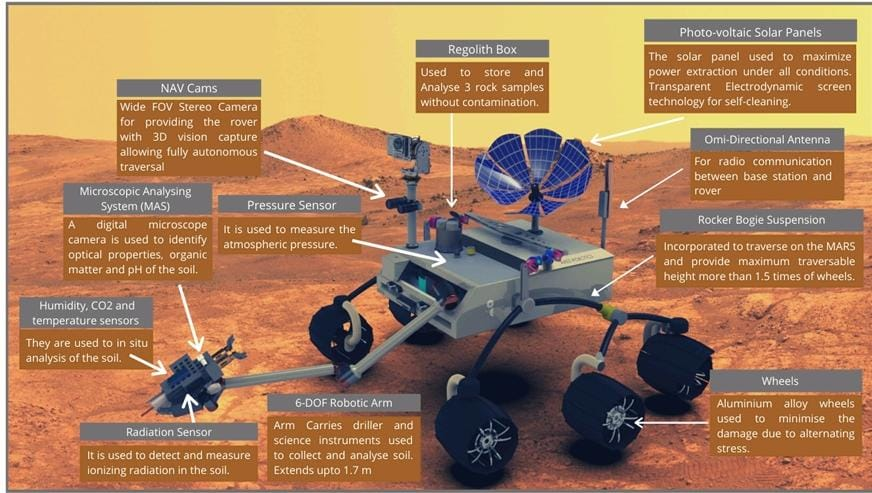
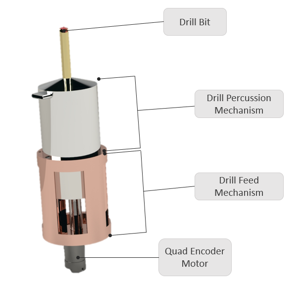
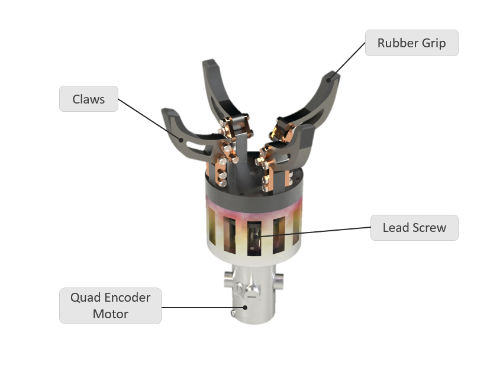
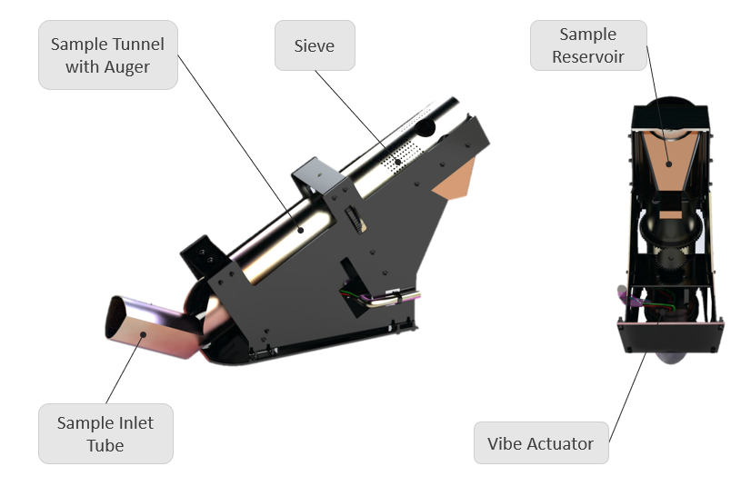

- ## [MobileRobot: Mechanical Design and Strength analysis of mobile robot with payload carrying capacity of 500kg.]()
    
    
    Designed Signature Product: In this project, I designed the CAD model of autonomous Mobile robot for heavy-duty
     warehouse logistics using Solidworks and performed finite element analysis of the model on ANSYS
     accompanied with urdf modelling for system to be compatible with ROS for autonomy.

    
    
    
    
    

- ## [International Rover Design Competition 2020](https://southasia.marssociety.org/irdc/)
    
    
In our Mars Rover project, I was responsible for developing the robotic arm, designed to perform complex tasks such as soil sampling to a depth of 10 cm, and operating a control panel with capabilities like turning knobs and typing. The arm, reaching 1.5 meters in height, could also carry and sort up to three rock samples concurrently without contamination. Built to endure the Martian extreme weather conditions, this modular component significantly enhanced the rover's functionality, supporting a continuous 15-Sol mission through versatile scientific and operational applications.
    
    <video src="../images/rover.mp4" alt="auv" width="480" controls></video>
    
    
    
    
    

